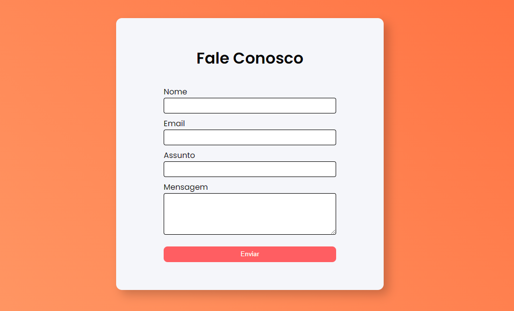

# Fale Conosco

Formulário simples e responsivo com o envio de e-mail atráves do [FormsPree](https://formspree.io/).
 <br />

## 💻 Tecnologias 

<br>
<br> <br>


### Resultado inicial

<br><br>

## 🚀 Iniciando

Para iniciar o projeto basta abrir o `index.html` em seu browser de preferência.

* OBS: Para que seja possivel o envio de e-mail deve-se alterar o endpoint no ```action``` do ```form``` de acordo com a sua conta no FormsPree.

---
##### Coded  by Denilson Melo
